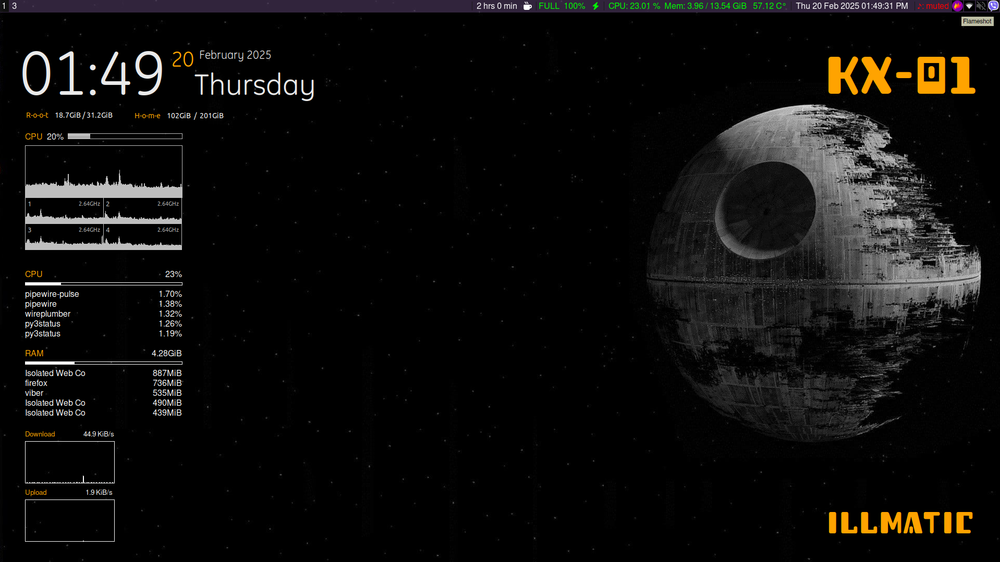
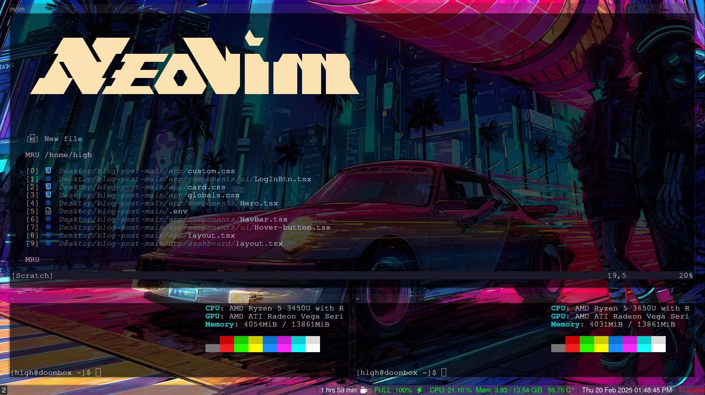

My arch setup for daily usage. 
Instead of using default i3 bar, I am using py3status which has different modules available and much better than i3status.<a href='https://ultrabug.github.io/py3status/'>py3status</a>
  Tried polybar but was buggy for me.
  Using conky-manager2 for conky. Now using the defaults it comes with.

